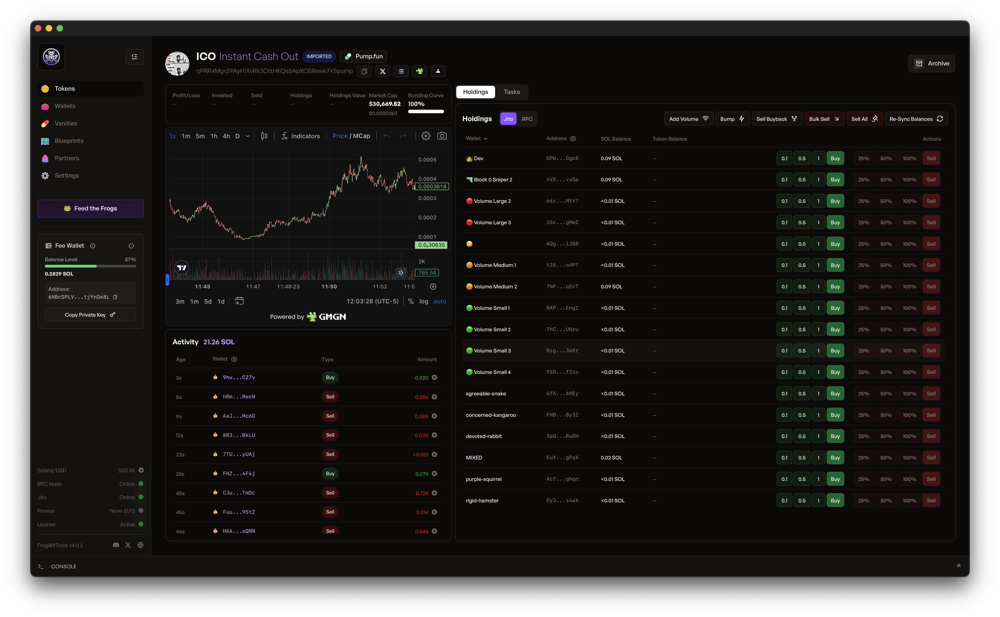

# Solana Vanity Address Generator

> **Part of [FrogWifTools](https://frogwiftools.com)** - Serverless launch tools for Solana token creators

## 

Generate custom Solana wallet addresses with specific suffixes like `ray`, `pump`, `bonk`, or any custom pattern. Perfect for branding your token launches on pumpfun, raydium, bonk and more or even just creating memorable wallet addresses.

## Features

- **Cross-Platform** - Works on macOS, Linux, and Windows (WSL/Git Bash)
- **Auto-Install** - Automatically installs Solana CLI if not present
- **Multi-Threaded** - Leverage all your CPU cores for faster generation
- **Base58 Export** - Outputs private keys ready to import into any wallet
- **Zero Dependencies** - Just bash, curl, and Python 3 (pre-installed on most systems)

## Quick Start

```bash
# Clone and run
git clone https://github.com/frogwiftools/vanity-generator.git
cd vanity-generator

# Make executable
chmod +x vanity-generator.sh

# Generate a vanity address ending in "pump"
./vanity-generator.sh --suffix pump --count 1 --threads 8
```

## Usage

```bash
./vanity-generator.sh [OPTIONS]

Options:
  -s, --suffix <value>    Suffix for the vanity address (required)
  -c, --count <number>    Number of addresses to generate (default: 1)
  -t, --threads <number>  Number of CPU threads to use (default: 4)
  -h, --help              Show help message
  --install-only          Only install Solana CLI, don't generate
  --no-merge              Skip merging and converting keypairs
```

## Examples

```bash
# Generate 5 addresses ending in "ray" using 8 threads
./vanity-generator.sh --suffix ray --count 5 --threads 8

# Generate 10 addresses ending in "pump"
./vanity-generator.sh -s pump -c 10 -t 16

# Generate addresses with custom suffix
./vanity-generator.sh --suffix abc123 --count 3 --threads 4

# Just install Solana CLI without generating
./vanity-generator.sh --install-only
```

## Output

The script generates a single output file:

```
<suffix>-vanities-<date>.txt
```

Each line contains a base58-encoded private key ready to import into Phantom, Solflare, or any Solana wallet.

## How It Works

1. **Installs Solana CLI** (if not already installed)
2. **Runs `solana-keygen grind`** to generate addresses matching your suffix
3. **Merges all keypairs** into a single JSON file
4. **Converts to base58** private keys for easy wallet import
5. **Cleans up** intermediate files, leaving only the final `.txt` file

## Performance Tips

- **More threads = faster generation** - Use `--threads` equal to your CPU core count
- **Shorter suffixes are faster** - Each additional character increases time exponentially
- **Case matters** - Solana addresses are case-sensitive (Base58)

| Suffix Length | Approximate Time (8 threads) |
| ------------- | ---------------------------- |
| 3 characters  | Seconds                      |
| 4 characters  | Minutes                      |
| 5 characters  | Hours                        |
| 6+ characters | Days+                        |

## Requirements

- **bash** (pre-installed on macOS/Linux)
- **curl** (pre-installed on most systems)
- **Python 3** (pre-installed on macOS/Linux)
- **jq** (auto-installed if missing)

## Troubleshooting

### Solana CLI not found after installation

Restart your terminal or run:

```bash
source ~/.bashrc  # or ~/.zshrc on macOS
```

### Permission denied

Make the script executable:

```bash
chmod +x vanity-generator.sh
```

### Generation is slow

- Reduce suffix length
- Increase thread count: `--threads 16`
- Use a machine with more CPU cores

---

## Part of FrogWifTools

This vanity generator is a standalone tool from **[FrogWifTools](https://frogwiftools.com)** - the powerful, serverless launchpad built for Solana token creators.

### Why FrogWifTools?

- **True Decentralization** - No backend servers, no databases, no middlemen
- **Your Data, Your Device** - Everything runs locally
- **Complete Token Toolkit** - Launch, manage, and automate your tokens

### Full Feature Set

| Feature               | Description                                     |
| --------------------- | ----------------------------------------------- |
| **Wallet Management** | Generate, fund, withdraw, tag, and warm wallets |
| **Token Launches**    | Launch new tokens with customizable parameters  |
| **Volume Automation** | Automate trading volume for your tokens         |
| **Bulk Operations**   | Mass sell, buyback, and bump operations         |
| **Blueprints**        | Save and reuse automation configurations        |
| **Vanity Addresses**  | Generate branded wallet addresses (this tool!)  |
| **P&L Tracking**      | Monitor profit and loss across your portfolio   |



### Get Started

- **Website**: [frogwiftools.com](https://frogwiftools.com)
- **Documentation**: [frogwiftools.gitbook.io](https://frogwiftools.gitbook.io/frogwiftools/)
- **Twitter**: [@frogwiftools](https://twitter.com/frogwiftools)

**Welcome Frogs!** 🐸

_Built with love for the Solana community_
